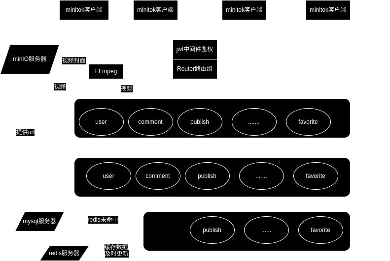
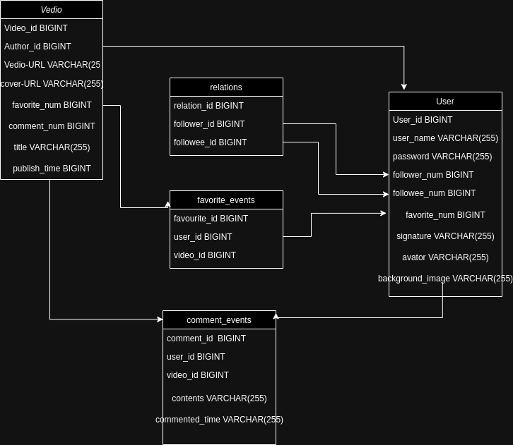
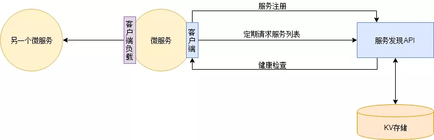
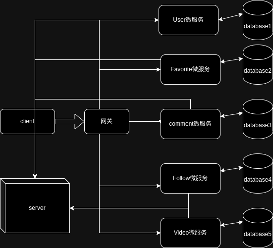

#  第六届字节跳动青训营`minitok`低配抖音项目

基于`gorm`框架+`gin`  http框架+`grpc`微服务框架+`minIO`存储 使用`docker`进行快速部署的低配版抖音项目：

项目小组成员：

| 成员  | 分工            | 是否完成 |
|-----|---------------|------|
| 肖追日 | 整体架构规划，确保项目进度 | ✔    |
| 黄依婷 | 鉴权            | ✔    |
| 彭健垚 | 喜欢，评论         | ✔    |
| 潘弘毅 | 用户信息          |✔ |
| 李洋阳 | 视频投稿和发布       |✔ |

### 主要技术选型：

- ORM框架 `gorm`
- http框架 `gin`
- 数据库 `mysql` `redis`
- 分布式对象存储 `minio`
- 配置解析 `viper`
- 日志管理 `zap`
- 项目部署 `docker` `docker-compose`
- 其他工具 `FFmpeg`

项目概览：

项目线上体验地址：http://103.146.231.207:8080 （廉价服务器性能难免不高）

项目本地内网调试 ip `192.168.0.101`

###  实现功能

| 功能    | 说明 | 是否实现 |
|-------| ------- |--|
| 基础功能  | 视频feed流、视频投稿，个人信息、用户登录、用户注册|  ✔ |
| 扩展功能1 | 视频点赞/取消点赞，点赞列表；用户评论/删除评论，视频评论列表| ✔ |
| 扩展功能2 | 用户关注/取关；用户关注列表、粉丝列表| ✔ |

### 快速上手启动：

前端准备：准备好字节跳动官方的[抖声app](https://bytedance.feishu.cn/docx/KwNudUZqQoGL6sxDzFscelaHnGg?chat_type=single&from=message&lang=zh&message_type=text&sourceType=#part-Og4bdiA7Foz5RAxJUfFcStLlnlh)

后端准备：准备好linux环境作为服务端，并且避免`9000`，`3306`，`6379`端口被占用；

首先配置好`docker`以及`docker-compose`;

然后使用命令`sudo docker-compose up`快速构建部署运行项目

(如果项目没有出现`[GIN-debug] Listening and serving HTTP on :8080)`建议重新运行`sudo docker-compose up`指令

### 项目架构介绍

由于本人之前没有接触过`golang`开发的项目，反而对`java`更加熟悉，所以本项目的架构主要借鉴了
传统的`MVC`三层架构，也就是对应的：
也就是：

- 控制层（Handler）：用于控制网络请求。

- 业务层（Service）：用于处理具体业务，还有简单的数据库操作。

- 持久层（Dao）：用于进行数据库的操作。可以引入抽象层，仓储模式（Repository Pattern）
来封装底层数据访问细节，并提供一致的接口供服务层使用。

数据库设计图示：

目前设计的数据库主要有5张表单组成，分别是`video`，`user`，`comment_events`，`favorite_events`以及`relations`组成。

  - video表单：该表单用于存储视频相关的信息。它包含以下列：video_id（视频的唯一标识符）、title（视频标题）、description（视频描述）、video-url（视频的URL地址）、cover-url（视频封面的地址）、publish—time（视频上传日期）、favorite_num(被喜欢的次数)、comments_num（被评论的次数）等。video表单用于存储视频的基本信息，以便于检索、管理和呈现视频内容。
  - user表单：该表单用于存储用户信息。它可能包含以下列：user_id（用户的唯一标识符）、username（用户名）、password（用户密码）、follower_num(关注者数量)，followee_num（被关注者数量）等。user表单用于管理用户的注册、登录和个人信息，以及与用户相关的操作和权限管理。
  - comment_events表单：该表单用于存储评论事件的信息。它可能包含以下列：comment_id（评论的唯一标识符）、video_id（所评论的视频ID）、user_id（发表评论的用户ID）、comment_text（评论内容）、timestamp（评论的时间戳）等。comment_events表单用于记录用户对视频的评论活动，以便于评论的展示、排序和统计分析。
  - favorite_events表单：该表单用于存储用户收藏事件的信息。它可能包含以下列：favorite_id（收藏的唯一标识符）、video_id（收藏的视频ID）、user_id（进行收藏的用户ID）、timestamp（收藏的时间戳）等。favorite_events表单用于追踪用户对视频的收藏行为，以便于个性化推荐、用户兴趣分析等功能的实现。
  - relations表单：该表单用于存储用户之间的关系信息，如关注关系、好友关系等。它可能包含以下列：relation_id（关系的唯一标识符）、follower_id（粉丝用户id）、followee_id（被关注的用户id）、timestamp（建立关系的时间戳）等。relations表单用于管理用户之间的关系，以便于社交功能的实现、推荐系统的个性化推荐等。

各个表单之间相互配合完成项目的主体功能。

### 本项目优势

- 使用docker技术进行部署，快速部署和高扩展性，同时保证资源隔离和安全性，易于管理和维护。
- 功能的高完成度，拓展功能基本全部实现
- 使用参数化查询来构造SQL代码，不使用字符串拼接，避免`SQL注入` 
- 引入JWT认证，进行全局TOKEN管理，进行无状态认证，降低了服务器的负担，同时还保有灵活性，可拓展性以及跨域和跨平台支持
- 使用`redis`的同步锁机制，防止多个线程同时修改一处数据
- 用户密码安全存储，基于`Blowfish`密码算法的密码哈希函数，具有单向不可逆的特性，返回用户基本信息时进行`脱敏`。

### 未来可改进方向：

由于作者团队学习进度以及时间限制，项目并未实现为分布式，后续可以考虑将项目实现为分布式，使得
各个微服务之间进一步相互解耦。

### 鸣谢

- [字节跳动青训营](https://youthcamp.bytedance.com/)
- [稀土掘金社区](https://juejin.cn/)
